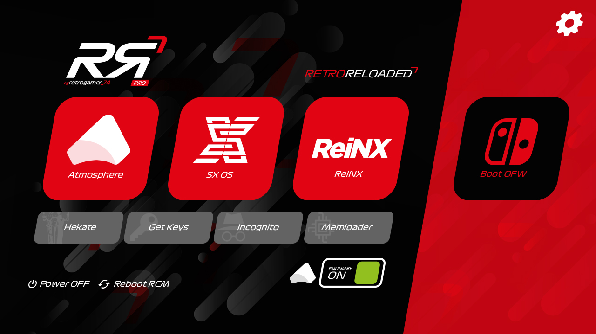
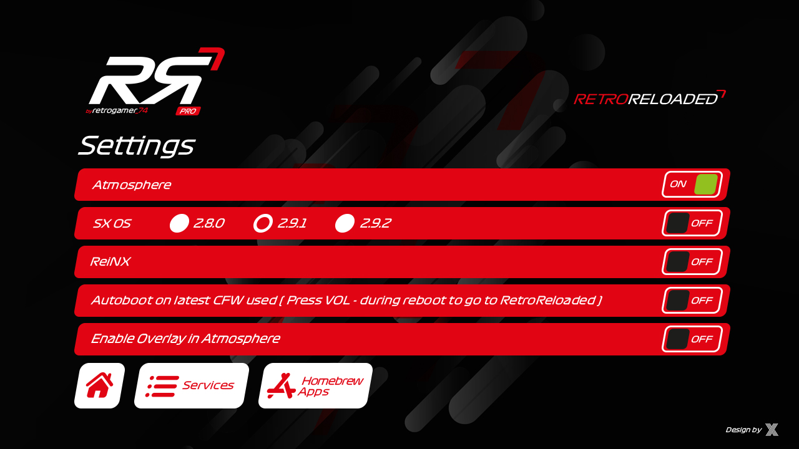
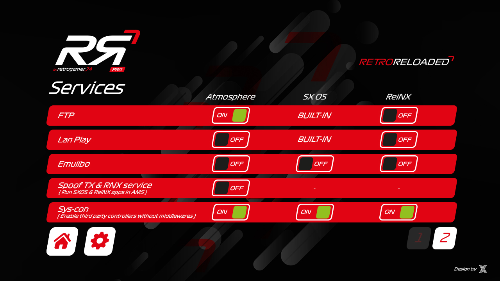
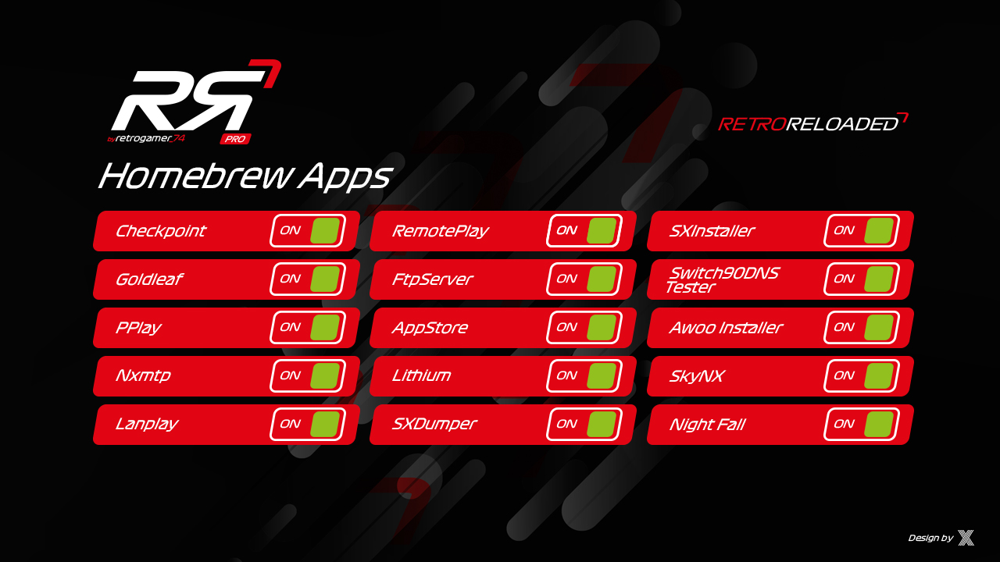
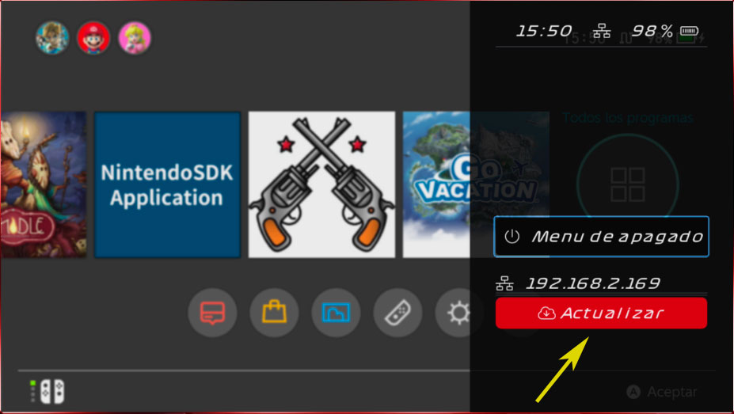
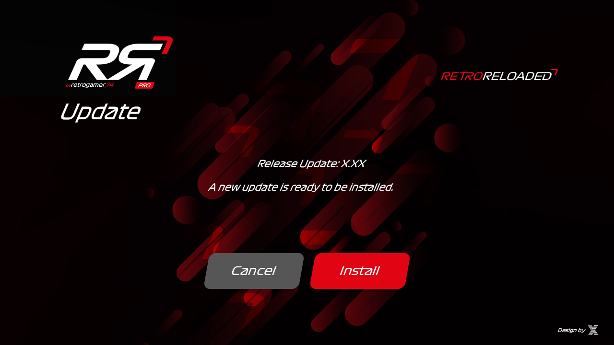

[Click here for English Version](https://github.com/RetroGamer74/RR_RetroReloaded/blob/master/README_EN.md)
# RR Pro (RetroReloaded Pro - Gestor de Arranque)  - BETA

Muy Importante: 
RetroReloaded Pro realiza actualizaciones a demanda del usuario mediante el botón actualizar. Esto sólo se puede realizar con conexión a internet. Por tanto asegúrate de que los DNS estén ajustados de acuerdo a los 90DNS o si utilizas SX OS el Stealth Mode esté activado.

Para todos los usuarios que quieran migrar a RR Pro, por favor eliminar las carpetas de la microSD, exceptuando: Nintend*,Emummc, Emutendo, y la license.dat de SX OS si es que la tienes. Se recomienda hacer un backup de tu carpeta Switch antes de eliminarla por si acaso tienes que recuperar alguna cosa. Recuerda recuperar los archivos de backup que pudiste haber hecho como por ejemplo incógnito o un backup completo de tu switch.

Puedes ver los cambios de cada versión en las [Releases.](https://github.com/RetroGamer74/RR_RetroReloaded/releases)

### Cambios Importantes
RR Pro integra un sistema modular de actualizaciones. Esto significa que ya no tendrás que venir a descargar de forma manual más actualizaciones. Usando el overlay, podrás pulsar el botón Home de la switch y manteniéndolo pulsado durante 3 segundos se hará emergente un menú, donde habrá un botón para que puedas actualizar.

Las actualizaciones ahora son más rápidas puesto que RetroReloaded ha sido troceado, para que las descargas sean independientes. Si se actualiza el payload de arranque no será necesario descargar todo el paquete completo como ocurría antes, y así ocurre en general con todo.

Cuando utilices la herramienta Hekate desde RetroReloaded hay un botón que pone Back RR que te permite volver al boot manager de RetroReloaded cuando quieras.

### Qué es RetroReloaded?

Es un Boot Manager para Switch que permite arrancar de una forma preconfigurada custom firmwares como Atmosphere, ReiNX y SX OS, desde un menú único. Además de herramientas de gran utilidad.

( Ver los  CRÉDITOS para más información )

Overlay customizado. Botón de Actualizar. Mantén presionado el botón home durante dos segundos y se mostrará el menú overlay.

Sistema AutoUpdate, ver más abajo información adicional.

## Instalación

### Descarga

Tienes dos opciones. Utilizar el Windows Installer, o descargar el zip que hay en la sección de [Releases](https://github.com/RetroGamer74/RR_RetroReloaded/releases) y extraerlo tu mismo sobre tu microSD.

#### Opción 1
#### NO USAR ESTE MÉTODO SI LO QUE SE QUIERE ES INSTALAR RR PRO. ESTE INSTALADOR ES SOLO PARA RR.
Descarga el [Windows RetroReloaded Installer](https://github.com/RetroGamer74/RR_RetroReloaded-RetroReloaded-Switch-RR/blob/master/RR_Installer.rar) para preparar tu microSD automáticamente. 

#### Opción 2
Descarga la última release disponible ( https://github.com/RetroGamer74/RR_RetroReloaded/releases ), extráela sobreescribiendo los archivos ya existentes en tu microSD. No sobreescribe archivos de configuración de tus aplicaciones ni te elimina datos.

### Arranque

Para arrancar RetroReloaded puedes usar las siguientes opciones.

#### Usando un cable USB-C y un PC

Si usas esta opción no tendrás que actualizar nunca el payload.bin. Descarga [NX_Payload_Forwarder](https://github.com/RetroGamer74/NX_Payload_Forwarder) que yo mismo he desarrollado, utilizando el siguiente enlace [link](https://github.com/RetroGamer74/NX_Payload_Forwarder), y copialo en alguna carpeta de tu PC. Este payload no requiere de actualizaciones porque cuando lo ejecutes lo único que hace es cargar el payload que se encuentre en la microSD. Por tanto la funcionalidad de este payload es siempre la misma y de esa manera evitas tener que copiar el payload.bin que venga actualziado en la release de RetroReloaded.

Una vez descargado y copiado, usando un inyector de payloads como por ejemplo TegraRCMGui, ( ver CREDITOS ), selecciona el fichero de payload que descargaste anteriormente ( NX Payload Forwarder ). Conecta por cable USB-C tu Switch y tu PC. Entra en el modo RCM, usando tu JIG y realizando las pulsaciones de Vol+ y Power. Si no sabes cómo hacer esto puedes entrar en nuestro discord a pedir ayuda.

[Enlace a los foros de soporte de RetroGamer_74](https://discord.gg/cUnjkPH)

#### Usando Dongles

##### Usando el dongle de SX OS ( TX )

Desde la versión 3.50 se puede usar el dongle de SX OS para arrancar RetroReloaded. Pincha el Dongle y arranca como sueles hacer. En vez de arrancar SX OS arrancará el menú de RetroReloaded, a no ser que hayas activado en RetroReloaded la opción de Autoboot, en cuyo caso deberás mantener pulsado el botón Vol - para que aparezca el menú cuando se esté reiniciando.

##### Usando el dongle de R4S

Puedes usar el dongle R4i. Utilizando el siguiente enlace oficial a descarga flasheareamos un payload forwarder.

https://bit.ly/2EsOeKj

Conecta tu dongle R4S a tu pc utilizando el cable microUSB. Pon el dongle en modo de escritura flash pulsando dos veces seguidas el botón que tiene en una de sus esquinas. Esto hará que automaticamente aparezca la ventana del explorador de archivos de Windows, y una nueva unidad en tu sistema. Ahora lo unico que tenemos que hacer es copiar el archivo con la extensión UF2 directamente sobre la nueva unidad que nos aparece en el explorador de archivos. Podemos hacer drag & drop. Una vez que el archivo se termina de copiar el dongle se desconecta del modo flasheo, y la unidad del explorador desaparece. En ese momento tu dongle ya está programado.

### Qué es el Overlay?

El overlay es técnicamente todas las capas que aparecen superpuestas a nivel informativo en la switch. Desde las notificaciones, el home button menú, y el menú de shutdown, son ejemplos de esto. Si decides sobreescribir el overlay y poner uno tuyo propio debes implementar todo para que al usuario no le falta ninguna funcionalidad.

RetroReloaded ha implementado un Overlay con la finalidad de hacer un menú de apagado que permita a sxos y a reinx ser reiniciados al payload de RetroReloaded para comodidad del usuario.

### Qué es el AutoUpdate?

RetroReloaded ha implementado una funcionalidad, aprovechando las posibilidades informativas del Overlay, para poner en background a descarga una actualización de RetroReloaded si es que realmente está disponible.

El Autoupdate ocurre en dos partes. La primera ocurre mientras estás jugando a la switch por ejemplo.
Recibirás una notificación al inicio de la descarga, y otra cuando el proceso haya terminado. Una vez recibida la primera notificación si haces emergente el menu home verás una barra de progreso, primero verde, y luego roja. Cuando el proceso termine te llegará la notificación de proceso finalizado. En este momento el update está listo para ser instalado, pero esto ocurrirá al reiniciar tu switch, para evitar que nada pueda corromperse.

Cuando arranques y entres en el menú de inicio de RetroReloaded verás un botón en la parte superior derecha que te indicará que hay una nueva actualización disponible. Púlsalo y sigue instrucciones. No hay perdida.

[Aquí puedes ver un vídeo del proceso.](https://youtu.be/gb_4ha3U1V8)

### Puedo usar RetroReloaded para hackear mi Mariko?

Sí. RetroReloaded está preparado para que puedas arrancar tu Mariko con custom firmware.

Sigue este [vídeo](https://youtu.be/chbpxLs0Akc?t=328)

### Puedo usar AutoRCM?

Claro. La primera vez que arranques RetroReloaded puedes arrancar la herramienta Hekate. En su menú de Tools, abajo a la derecha encontrarás la opción de AutoRCM. Una vez la habilites la consola ya no arrancará automáticamente sino que se quedará metida en el modo RCM esperando la inyección del Payload, bien desde TegraRCMGUI y tu PC, o bien al pincharle un dongle. De esta forma te ahorras el JIG. Ya no es necesario.

### Se puede desactivar AutoRCM?

Por supuesto. De la misma manera que lo has activado, se desactiva. Entras en Hekate desde el menú de RetroReloaded y te diriges al menú de Tools. Abajalo a la derecha encontrarás la opción de AutoRCM que ahora la tendrás habilitada. Pulsas sobre ella y se desactiva.

### Qué son los 90DNS?

90DNS es un servicio de DNS que proporciona unas direcciones IP para ser usadas como DNS Primario y DNS Secundario. Ajustadas sobre la configuración de red de tu consola, impedirán que esta se conecte a los servicios de NN. Evitando así cualquier riesgo de baneo. En las últimas releases el modo Stealth de SX OS se ha mostrado comprometido así que no es garantía. Recomendamos a todos los usuarios a añadir 90DNS además de tener el modo Stealth activado.

DNS Primario: 163.172.141.219

DNS Secundario: 207.246.121.77

### Puedo usar mis propios gamepdas de Xbox 360, Xbox One, PS3, PS4?

Sí. Hay un módulo integrado en RetroReloaded que aún está en desarrollo. Puedes habilitarlo en el menú de servicios. Requiere de momento tener conectada la switch al Dock, y conectar el gamepad por USB al dock. Está en desarrollo el soporte bluetooth.

### Puedo usar incógnito ?

Sí. Incógnito está ahora accesible desde el arranque de RetroReloaded, para no necesitar nunca más módulos dependientes del firmware. Pulsa el botón de Incógnito en la pantalla principal de arranque, haz el backup y actívalo. Eso es todo.

### Puedo usar Super Lan Play?

Por supuesto RetroReloaded está preparada para ser usada con Atmosphere y Super Lan Play.

### Puedo usar Emunand?

Sí. La emunand para Atmosphere tiene una integración especial en RetroReloaded. Una vez que la crees o la migres desde SX OS ( puedes usar este [vídeo](https://www.youtube.com/watch?v=WBO69FYA_UI) si quieres hacer compatible tu emunand de SX OS con Atmosphere ) aparecerá un nuevo botón en el Arranque de RetroReloaded, desde donde podrás activar o desactivar la emunand a la hora de arrancar.

Si quieres hacer una integración total y previamente tenías la emunand en SX OS, y ya has seguido el vídeo del enlace anterior y la has migrado a Atmosphere, recuerda que para hacerla compatible con atmosphere debes editar el archivo que hay en la carpeta emuMMC de tu microSD, que se llama emummc.ini y encontrarás unas líneas similares a estas:

[emummc]

enabled=1

sector=0x1a278800

path=emuMMC/RAW1

id=0x0000

nintendo_path=emuMMC/RAW1/Nintendo

Lo que tienes que hacer es cambiar las rutas path y nintendo_path a la carpeta Emutendo, que es la que originalmente utiliza SX OS en su emunand. Recuerda sólo debes hacer esto si quieres seguir usando la emunand tanto desde SX OS como desde Atmosphere. Aún así puede requerir la reinstalación de los juegos.

Por tanto el archivo quedaría así:

[emummc]

enabled=1

sector=0x1a278800

path=Emutendo

id=0x0000

nintendo_path=Emutendo

## Gestor de Arranque

Dependiendo de lo que necesites puedes utilizar los custom firmwares que están disponibles que son los siguientes.

**Primera Opción:**

**[Atmosphere]**

Actualmente 0.10.2.

Firmwares soportados: 1.0.0 - 9.1.0

Incluye soporte para jugar en Super Lan Play. Puedes jugar con tu Switch, incluso si está baneada, con otros jugadores en multiplayer. 

No es un servicio oficial. Lee bien las instrucciones y conéctate a nuestros foros de soporte en discord, porque hace falta cuenta para poder jugar.

http://lanboard.retrogamer.tech

**Segunda opción:**

**[ReiNX]**

Currently 2.4

Firmwares supported: 1.0.0 - 9.1.0

Incluye soporte para jugar en Super Lan Play. Puedes jugar con tu Switch, incluso si está baneada, con otros jugadores en multiplayer. 

No es un servicio oficial. Lee bien las instrucciones y conéctate a nuestros foros de soporte en discord, porque hace falta cuenta para poder jugar.

http://lanboard.retrogamer.tech

**Tercera opción:**

**[SX OS]**

Importante: Recuerda copiar tu license.dat en la raíz de tu microSD.

Firmware soportado: 1.0.0 - 9.1.0 (2.9.3 Beta)

Puedes jugar en Super Lan Play siempre que el servicio Lan Play del menú de opciones esté habilitado en SX OS y haya sido actualizado por los desarrolladores de SX OS.

## CREDITOS
**Atmosphere**

https://github.com/Atmosphere-NX/Atmosphere

**ReiNX**

https://github.com/Reisyukaku/ReiNX

**ArgonNX**

twitter: @Guillem_96

https://github.com/Guillem96/argon-nx

**TegraRCMGui**

https://github.com/eliboa/TegraRcmGUI/releases

**Switch Lan Play**

https://github.com/spacemeowx2/ldn_mitm/releases

**Hekate CTCaer**

https://github.com/CTCaer/hekate

**Sys - Con**

https://github.com/cathery/sys-con/
