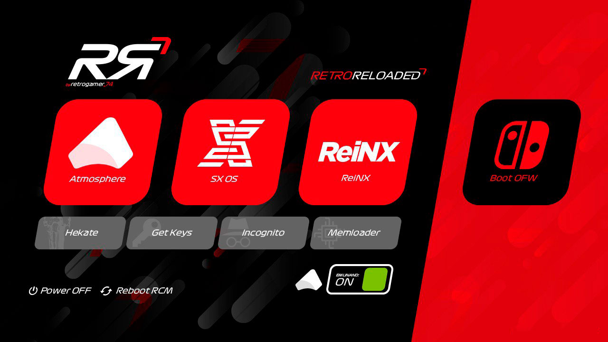

# RR 2.XX (RetroReloaded CFW)

Very Important: For new users, or users upgrading to RetroReloaded 2.XX for first time, please remove the folder atmosphere and ReiNX in your microSD if they already exists. This will provide a clean status before to start the installation.

You can see changelog on each release.

### Important Changelog 2.0.1
* Requires you update the payload.bin. So remember to copy payload.bin from this release to your desktop PC if you need to boot it using TegraRCMGui.

* Removed Template feature because it crashes in 8.0.0. Do not enable, by the way, using RetroReloaded Toolkit.

* Do not enable emuiibo service in firmware 8.0.0. It freeze startup.

### What RetroReloaded is?

This is a CFW for Switch based on already existant CFW like, Atmosphere, ReiNX, and SX OS. 

( See CREDITS for further info )

This package will allow you to boot a CFW like a Boot Manager. This is a solution All In One. ( AIO )

Touch support capable.

## Installation

### Download

You've got two options. Using the Windows Installer, or just downloading the retroreloaded package and extract it by yourself in your microSD.

#### Option 1
Just download the [Windows RetroReloaded Installer](https://github.com/RetroGamer74/RR_RetroReloaded-RetroReloaded-Switch-RR/blob/master/RR_Installer.rar) to automatically prepare your microSD. 

#### Option 2
Just download the latest release ( https://github.com/RetroGamer74/RR_RetroReloaded/releases ), extract it overwriting the existing files in your microSD.

### Boot

Boot using one of the next choices.

#### Option 1

Just for once, download the [NX_Payload_Forwarder](https://github.com/RetroGamer74/NX_Payload_Forwarder) I developed, using this [link](https://github.com/RetroGamer74/NX_Payload_Forwarder), and copy it in some place in your computer. You only need to download this payload once. You will always use the same, even RetroReloaded update its payload.

Using a payload injector, like TegraRCMGui, ( see CREDITS ), points the file browser to the payload.bin file. Connect an USB-C cable to link your Switch to your PC. Enter into RCM mode. If you don't know how to do that you will have to look for further info. That's not covered here. You can get help in our discord channel. You can join us using this link:

https://discord.gg/cUnjkPH

#### Option 2

You also can use R4i Dongle. Just using the official download link:

https://bit.ly/2EsOeKj

Connect your dongle to your PC using microUSB cable. Set it to Flash mode by pressing twice the button in the dongle. When you do that you will be able to browse the dongle folder. Drag & drop the new UF2 file downloaded from the link you used before. When the flash writing has finished the dongle folder will be closed automatically. You're ready to use. Use your jig, use your dongle. Enter into RCM and you will see the menu.

## The Toolkit

RetroReloaded 2.XX includes RetroReloaded Toolkit in the switch homebrew folder. You will find it into the homebrew apps list.

From this Toolkit you will be able to enable or disable the themes capability. Change the themes between the ones provided by RetroReloaded. Enable or disable services in background. Warm reboot.

Since RetroReloaded 2.XX, toolkit, it is already included in the full RetroReloaded CFW package. But if you want to download the toolkit only you can get it [here](https://github.com/RetroGamer74/RR_Updater-RetroReloaded-Switch-RR/releases) .

## Boot Manager

You're ready to choose your CFW. Depending on your desires, you can boot one of the three existing flavours.

**First choice:**

**[Atmosphere]**

Currently 0.9.0.

Firmwares supported: 1.0.0 - 8.0.0/8.0.1

Included support for playing to Super Lan Play. You can play with your Switch, even if it's banned, with other players, in multiplayer. 

It's not the official online service. So join to our discord, and follow instructions or starting going here:

http://lanboard.retrogamer.tech

**Second choice:**

**[ReiNX]**

Currently 2.2.1

Firmwares supported: 1.0.0 - 8.0.0 / 8.0.1

Included support for playing to Super Lan Play. You can play with your Switch, even if it's banned, with other players, in multiplayer. 

It's not the official online service. So join to our discord, and follow instructions or starting going here:

http://lanboard.retrogamer.tech

**Third choice:**

**[SX OS]**

Currently: It depends on the boot.dat file you copy in the boot of your microSD. Remember to copy your license.dat file also.

Firmware supported: 1.0.0 - 8.0.0 / 8.0.1

You can play in Super Lan Play service, as the other CFW. KIP patch was also included in SX OS.

## CREDITS
**Atmosphere**

https://github.com/Atmosphere-NX/Atmosphere

**ReiNX**

https://github.com/Reisyukaku/ReiNX

**ArgonNX**

twitter: @Guillem_96

https://github.com/Guillem96/argon-nx

**TegraRCMGui**

https://github.com/eliboa/TegraRcmGUI/releases

**Switch Lan Play**

https://github.com/spacemeowx2/ldn_mitm/releases

**Hekate CTCaer**

https://github.com/CTCaer/hekate
