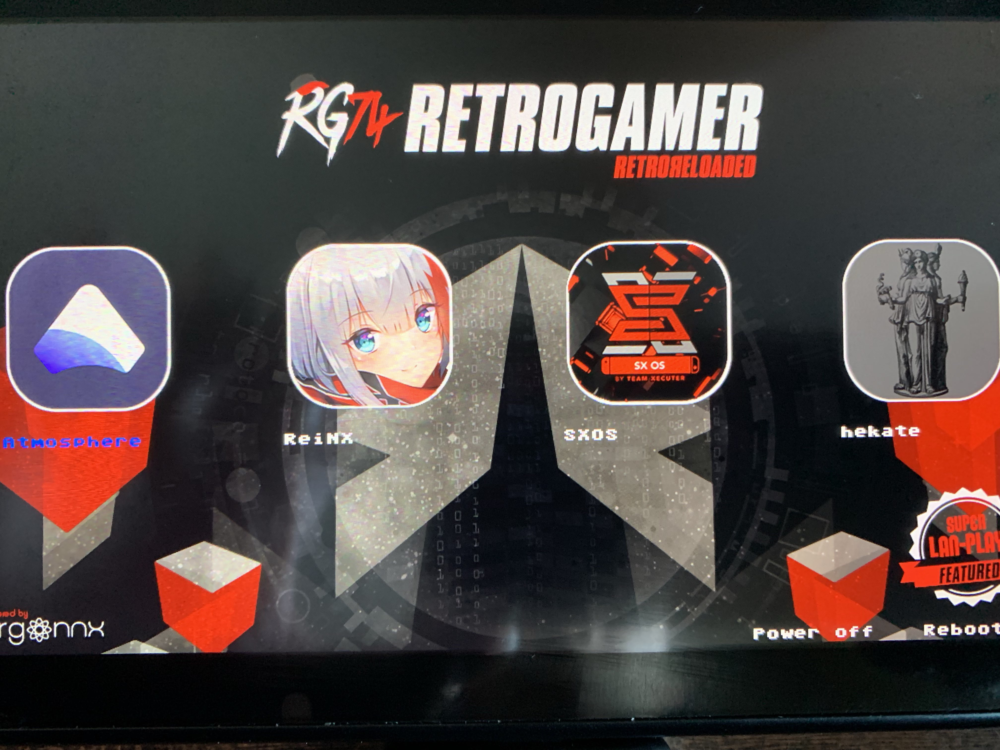

# RR 1.0 (RetroReloaded CFW)

This is a CFW for Switch based on already existant CFW like, Atmosphere, ReiNX, and SX OS. 

( See CREDITS for further info )

This package will allow you to boot a CFW like a Boot Manager. This is a solution All In One. ( AIO )

Installation
=============

1.- Just download the latest release ( https://github.com/RetroGamer74/RR_RetroReloaded/releases ), extract it overwriting the existing files in your microSD.

2.- Boot using one of the next choices.

**Option 1:**

You will find the file hekate_ctcaer_4.2.bin in the root of the microSD files. This package provides that file. It's also a credited file by CTCaer. Copy that file into your Desktop PC computer.

Using a payload injector, like TegraRCMGui, ( see CREDITS ), points the file browser to the hekate_ctcaer_4.2.bin file. Connect an USB-C cable to link your Switch to your PC. Enter into RCM mode. If you don't know how to do that you will have to look for further info. That's not covered here. You can get help in our discord channel. You can join us using this link:

https://discord.gg/cUnjkPH

**Option 2:**

You also can use R4i Dongle. Just using the official download link:

https://bit.ly/2zsClBu

Connect your dongle to your PC using microUSB cable. Set it to Flash mode by pressing twice the button in the dongle. When you do that you will be able to browse the dongle folder. Drag & drop the new UF2 file downloaded from the link you used before. When the flash writing has finished the dongle folder will be closed automatically. You're ready to use. Use your jig, use your dongle. Enter into RCM and you will see the menu.

Boot Manager
============

You're ready to choose your CFW. Depending on your desires, you can boot one of the three existing flavours.

**First choice:**

**[Atmosphere]**

Currently 0.8.2.

Firmwares supported: 1.0.0 - 6.2.0

Included support for playing to Super Lan Play. You can play with your Switch, even if it's banned, with other players, in multiplayer. 

It's not the official online service. So join to our discord, and follow instructions or starting going here:

http://lanboard.retrogamer.tech

**Second choice:**

**[ReiNX]**

Currently 1.8

Firmwares supported: 1.0.0 - 6.2.0

Included support for playing to Super Lan Play. You can play with your Switch, even if it's banned, with other players, in multiplayer. 

It's not the official online service. So join to our discord, and follow instructions or starting going here:

http://lanboard.retrogamer.tech

**Third choice:**

**[SX OS]**

Currently: It depends on the boot.dat file you copy in the boot of your microSD. Remember to copy your license.dat file also.

Firmware supported: 1.0.0 - 6.1.0

You can play in Super Lan Play service, but still not games that requires the KIP ( kernel patch ) to play games like SuperSmas..., Diab, and some others.

# CREDITS
**Atmosphere**

https://github.com/Atmosphere-NX/Atmosphere

**ReiNX**

https://github.com/Reisyukaku/ReiNX

**TegraRCMGui**

https://github.com/eliboa/TegraRcmGUI/releases

**Switch Lan Play**

https://github.com/spacemeowx2/ldn_mitm/releases

**Hekate CTCaer**

https://github.com/CTCaer/hekate
