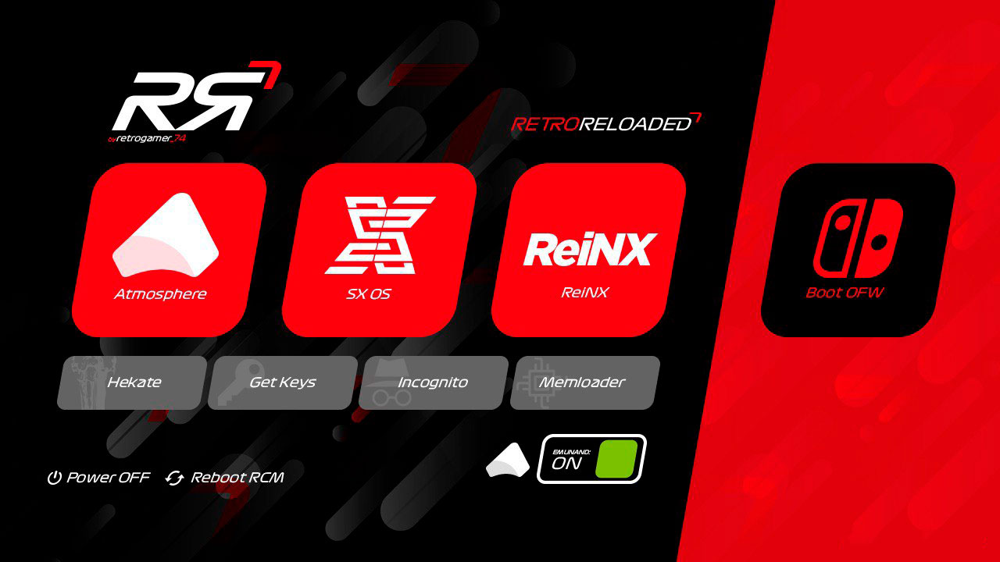
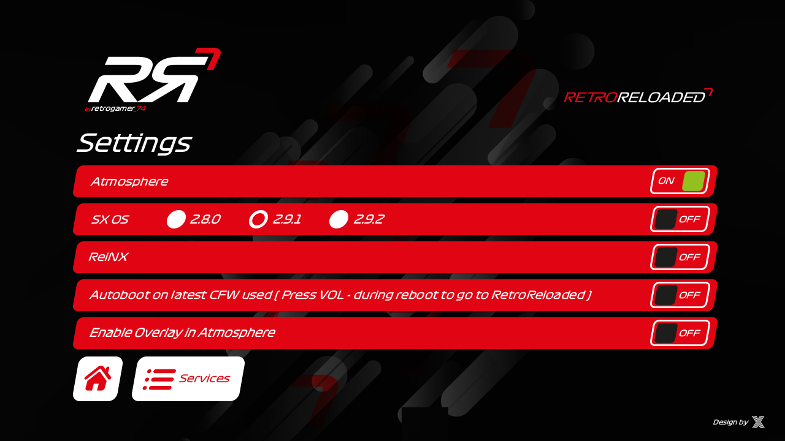
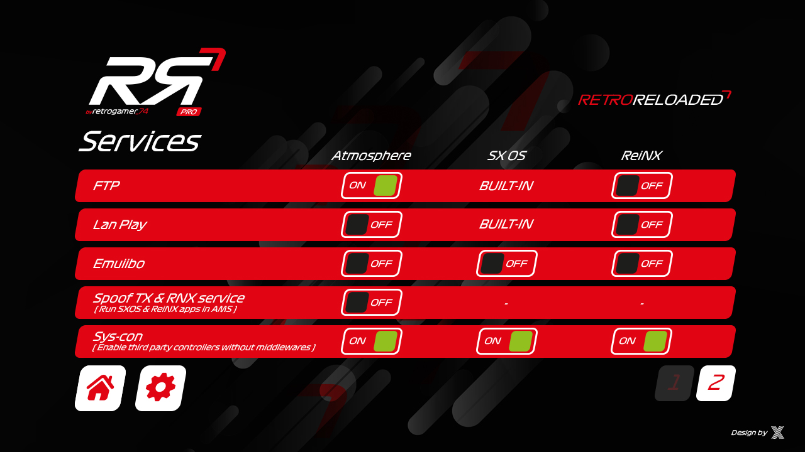
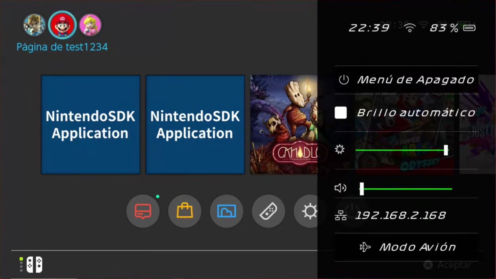
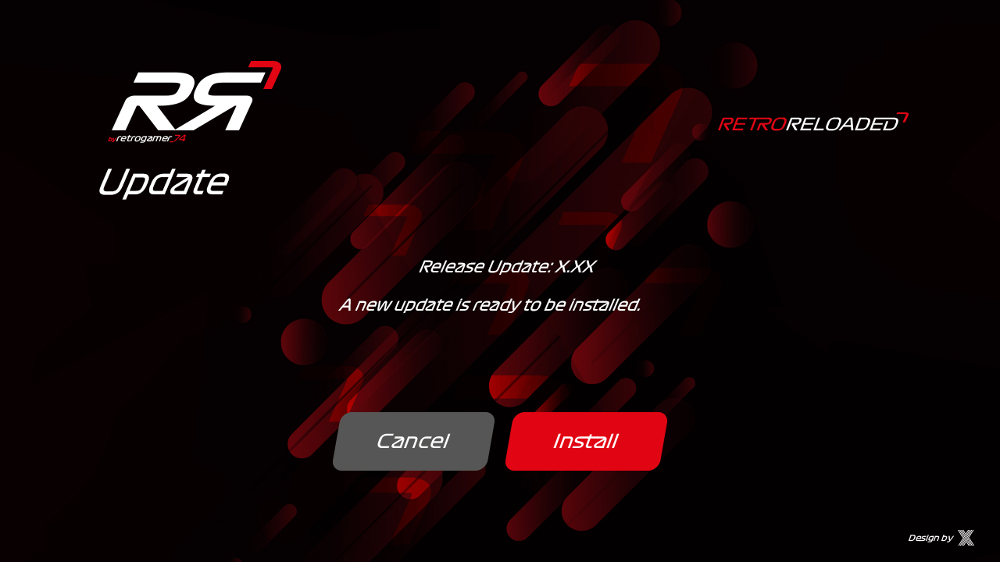
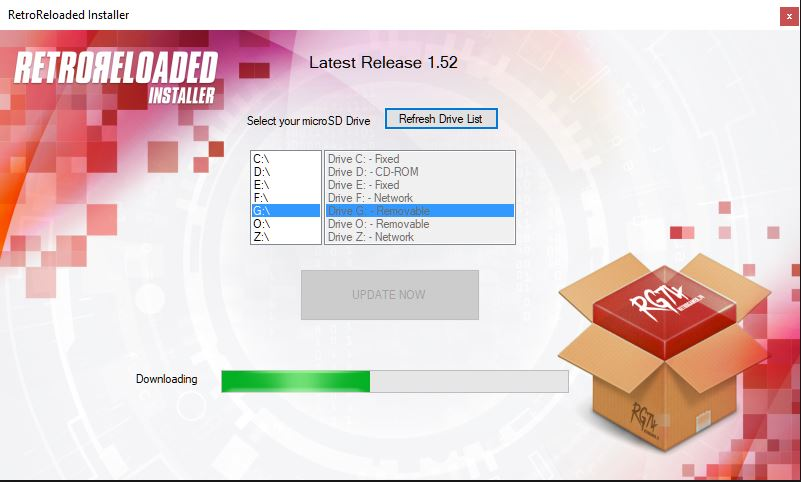

# RR (RetroReloaded - Boot Manager)

Very important: For all those users want to use RR Pro, remove all your folders in microSD except for the next ones: Nintend*,Emummc, Emutendo, and license.dat if you own SX OS. I suggest to do a backup of your switch folder before to delete it. Maybe you miss something later.
You can see the changes of each version in the [Releases.](Https://github.com/RetroGamer74/RR_RetroReloaded/releases)

### Important changes
* Whenever you download a version of RetroReloaded, it may be that the payload.bin that you will extract from the package and will be stored in your microSD in the root folder has been updated. If you use TegraRCMGUI to boot from your PC you must copy this file to your PC. Do not delete it from the SD. Just copy it, then launch it from TegraRCMGUI.

Tinfoil has been removed.

You can remove the Tinfoil and Mercury folders from your microSD folder if you still have them. They will no longer be used in the current context. Tinfoil now requires an ad-hoc version of Atmosphere prepared for this tool and is not acceptable.

When you use the Hekate tool from RetroReloaded there is a button that puts Back RR that allows you to return to the RetroReloaded boot manager whenever you want.

### What is RetroReloaded?

It is a Boot Manager for Switch that allows custom firmwares such as Atmosphere, ReiNX and SX OS to be started in a preconfigured way, from a single menu. In addition to useful tools.

(See CREDITS for more information)

Custom Overlay

Autoupdate feature. See below.

## Installation

### Download

You have two options. Use the Windows Installer, or download the zip in the [Releases] section (https://github.com/RetroGamer74/RR_RetroReloaded/releases) and extract it yourself on your microSD.

#### Option 1
Download the [Windows RetroReloaded Installer](https://github.com/RetroGamer74/RR_RetroReloaded-RetroReloaded-Switch-RR/blob/master/RR_Installer.rar) to prepare your microSD automatically.

#### Option 2
Download the latest available release (https://github.com/RetroGamer74/RR_RetroReloaded/releases), extract it by overwriting existing files on your microSD. It does not overwrite configuration files of your applications or delete data.

### Start

To start RetroReloaded you can use the following options.

#### Using a USB-C cable and a PC

If you use this option you will never have to update the payload.bin. Download [NX_Payload_Forwarder](https://github.com/RetroGamer74/NX_Payload_Forwarder) that I myself developed, using the following [link](https://github.com/RetroGamer74/NX_Payload_Forwarder), and copy it to some folder your PC This payload does not require updates because when you run it all it does is load the payload that is in the microSD. Therefore the functionality of this payload is always the same and that way you avoid having to copy the payload.bin that comes updated in the RetroReloaded release.

Once downloaded and copied, using a payload injector such as TegraRCMGui, (see CREDITS), select the payload file you previously downloaded (NX Payload Forwarder). Connect your Switch and your PC via USB-C cable. Enter RCM mode, using your JIG and pressing Vol + and Power. If you do not know how to do this you can enter our discord to ask for help.

[Link to RetroGamer_74 support forums](https://discord.gg/cUnjkPH)

#### Using Dongles

##### Using the SX OS (TX) dongle

Since version 3.50, the SX OS dongle can be used to start RetroReloaded. Plug-in your SX OS Dongle and start as you usually do. Instead of starting SX OS, the RetroReloaded menu will start, unless you have activated the Autoboot option in RetroReloaded. In that case you will have to press and hold the (Vol-) button so that the menu appears when it is restarting.

##### Using the R4S dongle

You can use the R4i dongle. Using the following official link to download we flash a payload forwarder.

https://bit.ly/2EsOeKj

Connect your R4S dongle to your pc using the microUSB cable. Put the dongle in flash writing mode by pressing the button in one of its corners twice in a row. This will automatically cause the Windows file explorer window to appear, and a new drive on your system. Now all we have to do is copy the file with the UF2 extension directly onto the new drive that appears in the file explorer. We can do drag & drop. Once the file is finished copying the dongle it is disconnected from the flashing mode, and the scanner unit disappears. At that time your dongle is already programmed.

### What is the Overlay?

The overlay is technically all layers that appear superimposed on an informational level on the switch. From the notifications, the home button menu, and the shutdown menu, are examples of this. If you decide to overwrite the overlay and put your own you must implement everything so that the user does not lack any functionality.

RetroReloaded has implemented an Overlay in order to make a shutdown menu that allows sxos and reinx to be able to reboot to the RetroReloaded payload for user convenience. Of course, home button menu, and notifications, are also implemented. So you shouldn't miss anything.

### What is AutoUpdate?

RetroReloaded has implemented a functionality, taking advantage of the informational possibilities of Overlay, to put in background to download an update of RetroReloaded if it really is available.

You will receive a notification at the beginning of the download, and another when the process is finished. This will happen while you're playing in your switch without any interference.

From there you can restart. Once in the boot menu of RetroReloaded, you will see a button in the upper right indicating that there is a new update available. Press it and follow instructions. There's no way to get lost.

[Here you can watch a video of the process.](https://youtu.be/gb_4ha3U1V8)

### Can I use RetroReloaded to hack my Mariko?

Yes. RetroReloaded is ready for you to boot your Mariko with custom firmware.

Follow this [video](https://youtu.be/chbpxLs0Akc?t=328)

### Can I use AutoRCM?

Sure. The first time you start RetroReloaded you can start the Hekate tool. In its Tools menu, on the bottom right you will find the AutoRCM option. Once you enable it, the console will no longer start automatically, but will remain in RCM mode waiting for the injection of the Payload, either from TegraRCMGUI and your PC, or by clicking a dongle. This way you save the JIG. It is no longer necessary.

### Can AutoRCM be disabled?

Of course. In the same way that you have activated it, it is deactivated. You enter Hekate from the RetroReloaded menu and go to the Tools menu. Lower it to the right you will find the AutoRCM option that you will now have enabled. Click on it and it deactivates.

### What are 90DNS?

90DNS is a DNS service that provides IP addresses to be used as Primary DNS and Secondary DNS. Adjusted on your console's network settings, they will prevent it from connecting to NN services. Thus avoiding any risk of banning. In recent releases SX OS Stealth mode has been compromised so it is not a guarantee. We recommend all users to add 90DNS in addition to having Stealth mode enabled.

Primary DNS: 163,172,141,219

Secondary DNS: 207.246.121.77

### Can I use my own Xbox 360, Xbox One, PS3, PS4 gamepads?

Yes. There is a new sysmodule included in RetroReloaded (sys-con). You can enable it thru RetroReloaded Boot Manager Services menu. By the way it requirea connect the switch to the dock, and connect the gamepad thru USB to the dock. Bluetooth support is still in development.

### Can I use incognito?

Yes. Incognito is now accessible from the start of RetroReloaded, so you never need any more firmware-dependent modules. Press the Incognito button on the main boot screen, make the backup and activate it. That's it.

### Can I use Super Lan Play?

Of course RetroReloaded is ready to be used with Atmosphere and Super Lan Play.

### Can I use Emunand?

Yes. The emunand for Atmosphere has a special integration in RetroReloaded. Once you create or migrate it from SX OS (you can use this [video](https://www.youtube.com/watch?v=WBO69FYA_UI) if you want to make your SX OS emunand compatible with Atmosphere) a new one will appear StartReloaded Start button, from where you can activate or deactivate the emunand at boot time.

If you want to make a full integration and previously had the emunand in SX OS, and you have already followed the video of the previous link and have migrated it to Atmosphere, remember that to make it compatible with atmosphere you must edit the file in the emuMMC folder of your microSD, which is called emummc.ini and you will find some lines similar to these:

[emummc]

enabled = 1

sector = 0x1a278800

path = emuMMC / RAW1

id = 0x0000

nintendo_path = emuMMC / RAW1 / Nintendo

What you have to do is change the path and nintendo_path paths to the Emutendo folder, which is the one originally used by SX OS in your emunand. Remember you should only do this if you want to continue using the emunand both from SX OS and from Atmosphere. Still it may require reinstallation of the games.

Therefore the file would look like this:

[emummc]

enabled = 1

sector = 0x1a278800

path = Emutendo

id = 0x0000

nintendo_path = Emutendo

## Boot Manager

Depending on what you need you can use the custom firmwares that are available that are the following.

**First option:**

** [Atmosphere] **

Currently 0.9.4.

Supported firmware: 1.0.0 - 9.1.0

Includes support to play in Super Lan Play. You can play with your Switch, even if it is banned, with other players in multiplayer.

It is not an official service. Read the instructions well and connect to our support forums at discord, because you need an account to play.

http://lanboard.retrogamer.tech

**Second option:**

** [ReiNX] **

Currently 2.4

Firmwares supported: 1.0.0 - 9.1.0

Includes support to play in Super Lan Play. You can play with your Switch, even if it is banned, with other players in multiplayer.

It is not an official service. Read the instructions well and connect to our support forums at discord, because you need an account to play.

http://lanboard.retrogamer.tech

**Third option:**

** [SX OS] **

Important: Remember to copy your license.dat to the root of your microSD.

Firmware supported: 1.0.0 - 9.1.0 (2.9.3 Beta)

You can play in Super Lan Play as long as the Lan Play service in the options menu is enabled in SX OS and has been updated by SX OS developers.

## CREDITS
** Atmosphere **

https://github.com/Atmosphere-NX/Atmosphere

** ReiNX **

https://github.com/Reisyukaku/ReiNX

** ArgonNX **

twitter: @ Guillem_96

https://github.com/Guillem96/argon-nx

** TegraRCMGui **

https://github.com/eliboa/TegraRcmGUI/releases

** Switch Lan Play **

https://github.com/spacemeowx2/ldn_mitm/releases

** Hekate CTCaer **

https://github.com/CTCaer/hekate

** Sys - Con **

https://github.com/cathery/sys-con/
